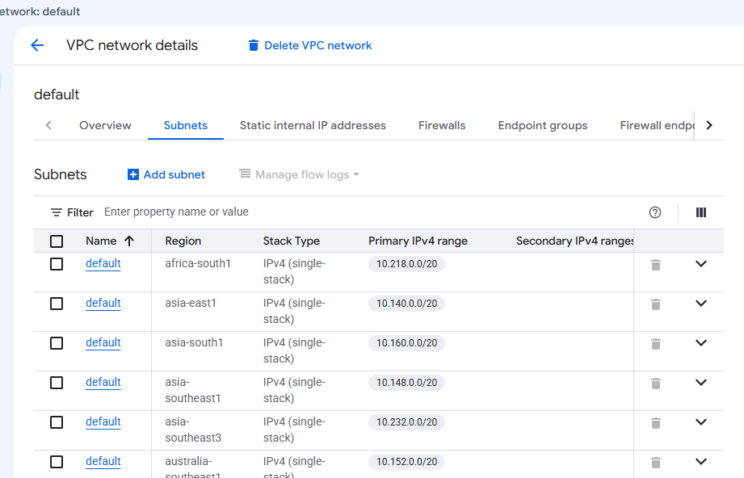
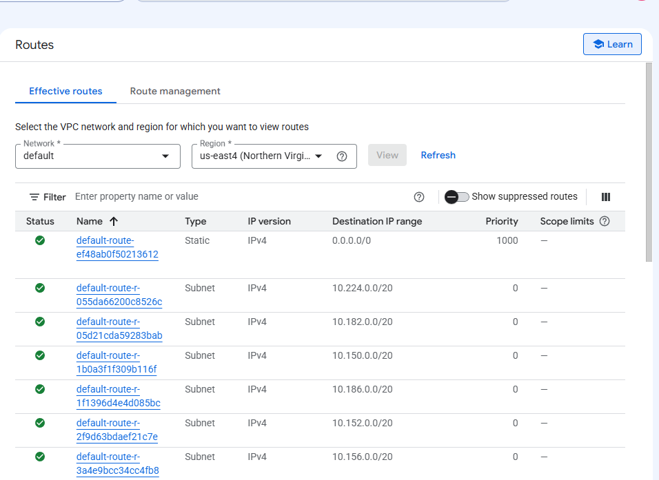
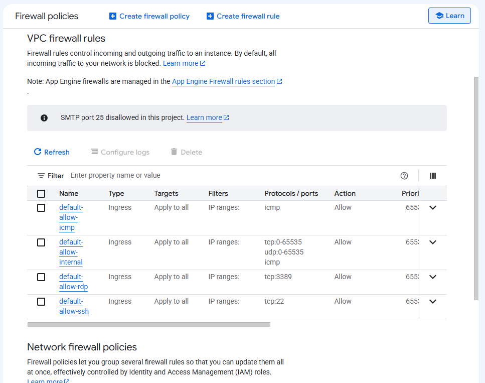
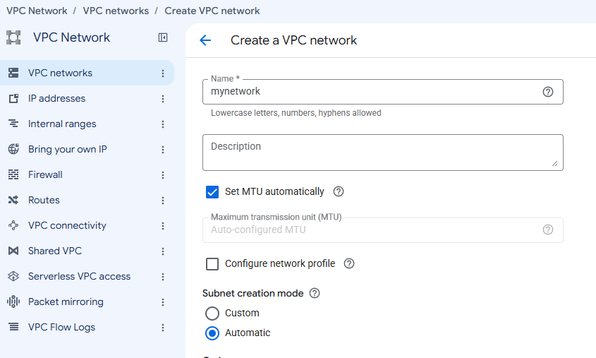
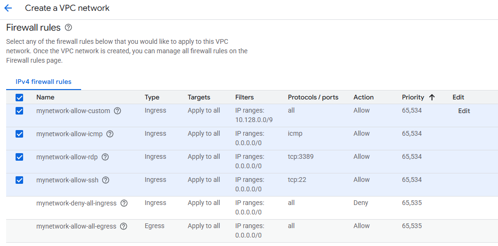
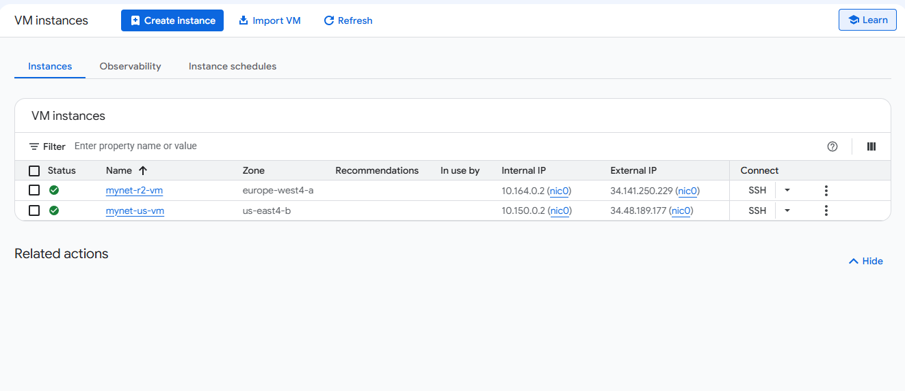
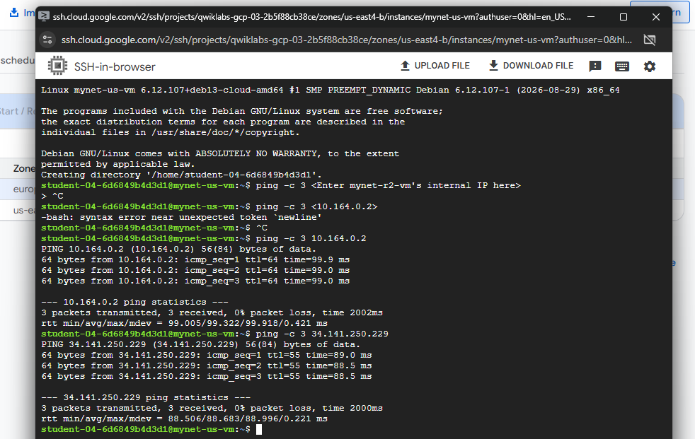

# Get Started with VPC Networking and Compute Engine

## Overview

This hands-on lab explores the fundamentals of networking in Google Cloud using **Virtual Private Cloud (VPC)** and **Compute Engine**.

The lab covers the default VPC network, subnets, routes, firewall rules, VM instances, and network connectivity. A new auto mode VPC network was created, two Compute Engine VM instances were deployed, and connectivity was tested using SSH and ICMP.

## Objectives

- Explore the default VPC network.
- Examine subnets, routes, and firewall rules.
- Delete the default VPC network.
- Verify that VM instances cannot be created without a VPC network.
- Create an auto mode VPC network.
- Configure firewall rules.
- Create two Compute Engine VM instances.
- Test connectivity between VM instances.
- Analyze how firewall rules affect network connectivity.

## Google Cloud Services and Concepts

| Service / Concept | Description |
|---|---|
| **VPC Network** | Provides the virtual networking infrastructure for Google Cloud resources. |
| **Subnet** | A regional subdivision of a VPC network used to assign internal IP addresses to resources. |
| **Route** | Determines how network traffic is forwarded to its destination. |
| **Firewall Rule** | Controls which network traffic is allowed or denied. |
| **Compute Engine** | Google Cloud service used to create and run virtual machines. |
| **VM Instance** | A virtual machine running on Google Cloud infrastructure. |
| **SSH** | Secure protocol used to connect to Linux VM instances. |
| **ICMP** | Network protocol used by tools such as `ping` to test connectivity. |
| **Internal IP** | Private IP address used for communication within a VPC network. |
| **External IP** | Public IP address that can be used for communication over the Internet. |

---

## 1. Exploring the Default VPC Network

Every Google Cloud project starts with a **default VPC network**. The default network includes subnets, routes, and firewall rules.

### Subnets

The default VPC contains a subnet in each Google Cloud region. Each subnet has an internal IP address range and a gateway.



### Routes

VPC routes determine how traffic is sent from VM instances to destinations inside or outside the network.

The default VPC contains routes that allow traffic to be directed between its subnets and to the Internet.



### Firewall Rules

The default VPC includes firewall rules that control incoming traffic.

The rules observed in the lab included:

- `default-allow-icmp`
- `default-allow-rdp`
- `default-allow-ssh`
- `default-allow-internal`

These rules allow specific types of traffic such as ICMP, SSH, RDP, and internal network traffic.



---

## 2. Removing the Default VPC Network

The default firewall rules were removed, followed by the deletion of the `default` VPC network.

After deleting the network, there were no routes or firewall rules associated with a VPC network.

An attempt was then made to create a Compute Engine VM instance without a VPC network. The operation failed because there was no available network for the VM.

This demonstrates that a VPC network is required for Compute Engine VM networking.

---

## 3. Creating the Auto Mode VPC Network

A new VPC network named `mynetwork` was created using **Auto mode** subnet creation.

In an auto mode VPC, subnets are automatically created in each Google Cloud region.

Firewall rules were also configured to provide the connectivity required for the lab.





---

## 4. Creating Compute Engine VM Instances

Two Compute Engine VM instances were created and attached to `mynetwork`:

- `mynet-us-vm`
- `mynet-r2-vm`

Both VMs used:

- **Series:** E2
- **Machine type:** `e2-micro`
- **2 vCPUs**
- **1 GB memory**

Each VM received an internal IP address from the subnet associated with its selected region and zone. The VMs also had ephemeral external IP addresses.



### Internal and External IP Addresses

The VMs use two types of IP addresses:

- **Internal IP:** Used for communication within the VPC network.
- **External IP:** Used for communication through the Internet.

The external IP addresses assigned to these VMs are ephemeral, meaning they can change if the VM is stopped and started again.

---

## 5. Testing VM Connectivity

Connectivity was tested by connecting to `mynet-us-vm` through **SSH** and using the `ping` command to test communication with `mynet-r2-vm`.

### SSH

SSH access was possible because the `mynetwork-allow-ssh` firewall rule allows incoming TCP traffic on port `22`.

### Internal Connectivity

The internal IP address of `mynet-r2-vm` was tested using ICMP:

```bash
ping -c 3 <internal-ip>
```

The ping succeeded because the `mynetwork-allow-custom` firewall rule permits the required internal traffic.

### External Connectivity

The external IP address of `mynet-r2-vm` was also tested using ICMP:

```bash
ping -c 3 <external-ip>
```

The connectivity worked because the `mynetwork-allow-icmp` firewall rule permits ICMP traffic.



---

## 6. Understanding Firewall Behavior

The lab also demonstrated how firewall rules directly affect network connectivity.

### `mynetwork-allow-icmp`

When the ICMP firewall rule is removed, ping traffic to the external IP address is blocked.

The lab showed that this results in packet loss when attempting to ping the external IP.

### `mynetwork-allow-custom`

When the custom firewall rule is removed, ping traffic to the internal IP address is blocked.

This demonstrates that internal communication also depends on the appropriate firewall rules.

### `mynetwork-allow-ssh`

When the SSH firewall rule is removed, a new SSH connection to the VM fails because TCP traffic on port `22` is no longer allowed.

These tests demonstrate how VPC firewall rules control network traffic to and from VM instances.

> Note: The final firewall-removal tests were performed as part of the lab, but separate screenshots were not captured for these tests.

---

## Key Concepts Learned

### VPC

A **Virtual Private Cloud (VPC)** provides the networking environment required by resources such as Compute Engine VM instances.

### Subnets

Subnets are regional subdivisions of a VPC network. They provide IP address ranges from which VM instances receive internal IP addresses.

### Routes

Routes determine where network traffic is sent and allow communication between different destinations within or outside the VPC.

### Firewall Rules

Firewall rules control which traffic is allowed to reach or leave VM instances.

### Internal vs. External IP

Internal IP addresses are used for private communication within the VPC, while external IP addresses provide public connectivity.

### SSH

SSH provides secure remote access to Linux VM instances.

### ICMP

ICMP is used by tools such as `ping` to verify network connectivity.

### Auto Mode VPC

An auto mode VPC automatically creates subnets in Google Cloud regions, simplifying initial network configuration.

---

## Key Takeaways

- A **VPC network is required** for Compute Engine VM networking.
- VPC networks contain **subnets, routes, and firewall rules**.
- **Subnets are regional**, while a VPC network is a global resource.
- **Routes determine how traffic reaches its destination.**
- **Firewall rules control network traffic** to and from VM instances.
- Internal and external connectivity can be tested using **ICMP and `ping`**.
- **SSH connectivity depends on the appropriate firewall rule allowing TCP port 22.**

## Lab Architecture

```text
                 Google Cloud
                      │
                ┌─────┴─────┐
                │  mynetwork │
                │    VPC     │
                └─────┬─────┘
                      │
             ┌────────┴────────┐
             │                 │
       ┌─────▼─────┐     ┌─────▼─────┐
       │mynet-us-vm│     │mynet-r2-vm │
       │ Compute   │     │  Compute   │
       │  Engine   │     │   Engine   │
       └─────┬─────┘     └─────┬─────┘
             │                 │
             └───────┬─────────┘
                     │
              Network Connectivity
              Internal / External
                     │
              Firewall Rules
```

## Conclusion

This hands-on lab provided practical experience with Google Cloud networking by creating and configuring a VPC network, subnets, routes, firewall rules, and Compute Engine VM instances.

The connectivity tests demonstrated how VPC networking and firewall rules work together to control communication between cloud resources. The lab also showed that Compute Engine instances require a VPC network and that firewall configuration directly determines which network connections are permitted.