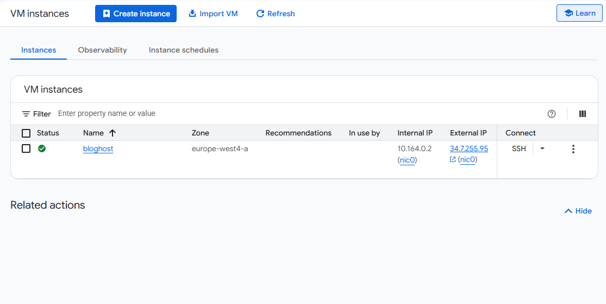
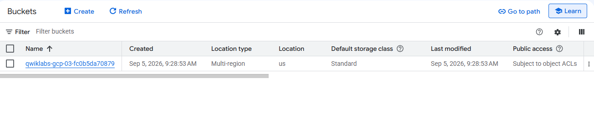
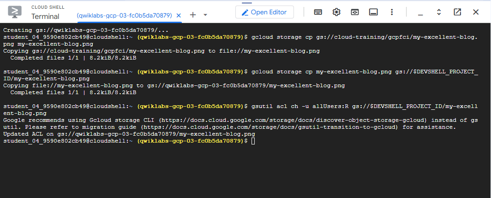
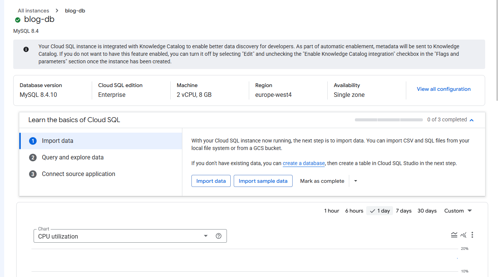
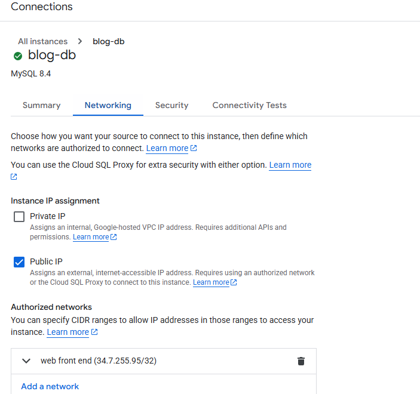
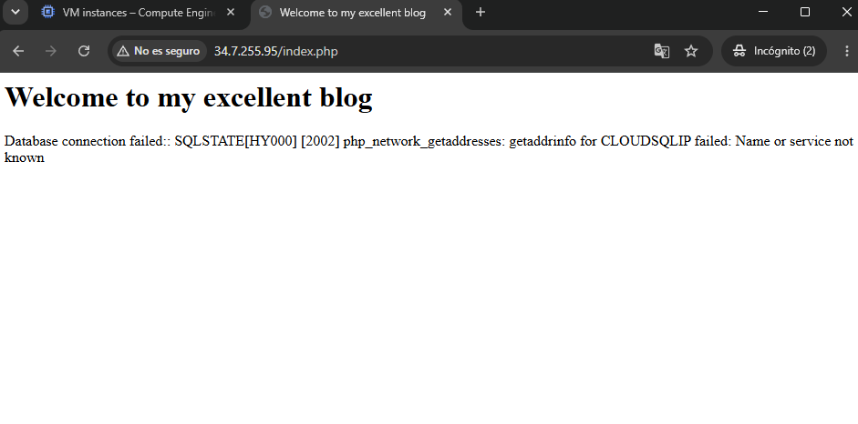
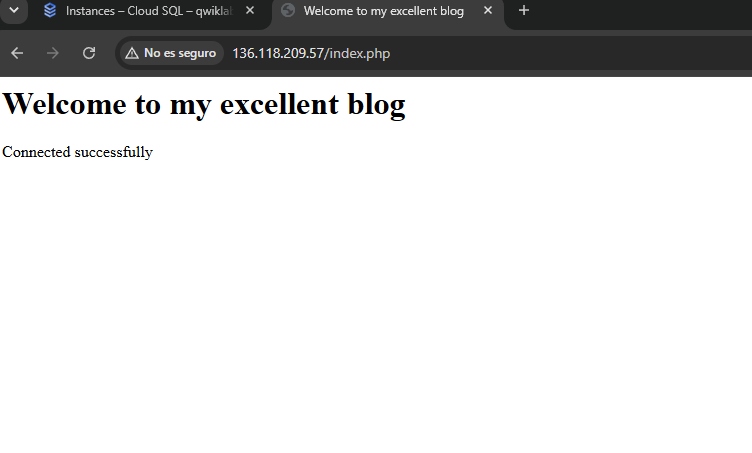
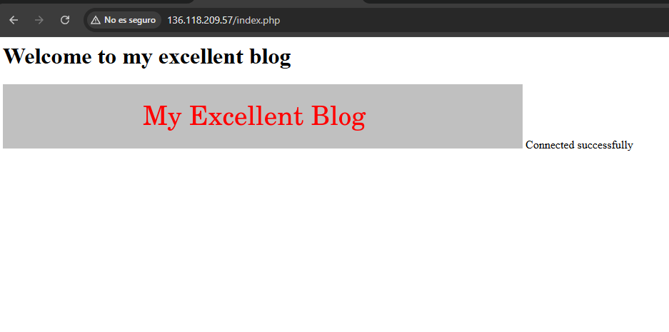

# Google Cloud Fundamentals: Cloud Storage and Cloud SQL

## Overview

This lab demonstrates the integration of Google Cloud services to deploy a simple PHP web application, connect it to a managed MySQL database through Cloud SQL, and serve an image stored in Cloud Storage.

The implementation uses:

- **Compute Engine** to host the web server.
- **Apache** to serve the application.
- **PHP** to execute the application.
- **Cloud SQL** to provide a managed MySQL database.
- **Cloud Storage** to store the blog image.
- **Cloud Shell** to manage Cloud Storage resources.

## Objectives

- Deploy a web server on Compute Engine.
- Configure Apache and PHP with a startup script.
- Create a Cloud Storage bucket and upload an image.
- Configure access to the stored object.
- Create and configure a Cloud SQL MySQL instance.
- Allow the web server to connect to Cloud SQL.
- Configure the PHP application to connect to MySQL.
- Display the Cloud Storage image in the web application.

---

## Architecture

```text
                           Internet
                              |
                              v
                    +-------------------+
                    |  Compute Engine   |
                    |      bloghost     |
                    |                   |
                    | Apache + PHP      |
                    |    index.php      |
                    +---------+---------+
                              |
                              | MySQL
                              v
                    +-------------------+
                    |     Cloud SQL     |
                    |      blog-db      |
                    |      MySQL 8.4    |
                    +-------------------+

                              |
                              | Image URL
                              v
                    +-------------------+
                    |  Cloud Storage    |
                    |       Bucket      |
                    |                   |
                    | my-excellent-     |
                    | blog.png          |
                    +-------------------+
````

---

# 1. Compute Engine

A Compute Engine virtual machine named `bloghost` was created to host the web application.

### VM Configuration

```text
Name:        bloghost
Zone:        europe-west4-a
Internal IP: 10.164.0.2
External IP: 34.7.255.95
```

HTTP traffic was enabled in the VM firewall configuration so the application could be accessed through the VM external IP address.



## Web Server Configuration

A startup script was used to automatically install Apache, PHP, and the PHP MySQL extension:

```bash
#!/bin/bash
apt-get install apache2 php php-mysql -y
service apache2 restart
```

Apache acts as the web server, PHP executes the application, and `php-mysql` provides the PHP components required for MySQL connectivity.

---

# 2. Cloud Storage

A Cloud Storage bucket was created from Cloud Shell.

### Bucket Configuration

```text
Bucket:        qwiklabs-gcp-03-fc0b5da70879
Location:      US
Location type: Multi-region
Storage class: Standard
```

A bucket is the container used to store objects. In this lab, the stored object is the blog image.



## Create the Bucket

```bash
export LOCATION=US
gcloud storage buckets create -l $LOCATION gs://$DEVSHELL_PROJECT_ID
```

## Download the Image

The image provided by the lab was downloaded to Cloud Shell:

```bash
gcloud storage cp gs://cloud-training/gcpfci/my-excellent-blog.png my-excellent-blog.png
```

## Upload the Image

The image was then uploaded to the newly created bucket:

```bash
gcloud storage cp my-excellent-blog.png gs://$DEVSHELL_PROJECT_ID/my-excellent-blog.png
```

The resulting object was:

```text
my-excellent-blog.png
```



## Configure Object Access

The object was configured to allow public read access:

```bash
gsutil acl ch -u allUsers:R gs://$DEVSHELL_PROJECT_ID/my-excellent-blog.png
```

The permission:

```text
allUsers:R
```

means that all users have read access to the object.

---

# 3. Cloud SQL

A managed MySQL instance was created using Cloud SQL.

### Instance Configuration

```text
Instance:      blog-db
Database:      MySQL 8.4.10
Edition:       Enterprise
Machine:       2 vCPU, 8 GB
Region:        europe-west4
Availability:  Single zone
```

A database user was created for the web application:

```text
Username: blogdbuser
```



Cloud SQL provides the managed database infrastructure, while MySQL is the database engine used by the application.

---

# 4. Cloud SQL Networking

The Cloud SQL instance was configured to use a public IP connection.

The external IP address of the Compute Engine VM was added as an authorized network:

```text
34.7.255.95/32
```

The `/32` CIDR notation represents one specific IPv4 address.

This means that the configured address was authorized to establish a connection with the Cloud SQL instance.



### Network Flow

```text
Compute Engine VM
       |
       | 34.7.255.95/32
       |
       v
   Cloud SQL
       |
       v
     MySQL
```

---

# 5. PHP Application

The Apache document root was accessed through the VM:

```bash
cd /var/www/html
```

The application file was edited with:

```bash
sudo nano index.php
```

The database connection used PHP PDO:

```php
$dbserver = "CLOUDSQLIP";
$dbuser = "blogdbuser";
$dbpassword = "DBPASSWORD";

$conn = new PDO(
    "mysql:host=$dbserver;dbname=mysql",
    $dbuser,
    $dbpassword
);
```

`PDO` (PHP Data Objects) is the interface used by the PHP application to establish the MySQL connection.

The application also used exception handling to detect connection problems and display the result during the laboratory.

---

# 6. Database Connection Test

The first connection attempt failed because the application still contained the placeholder:

```text
CLOUDSQLIP
```

instead of the real Cloud SQL public IP address.

The browser displayed:

```text
Database connection failed: ...
```



## Cause

PHP attempted to use `CLOUDSQLIP` as the database host. Since this was only a placeholder and not a valid database address, the connection could not be established.

## Resolution

The PHP file was edited again:

```bash
sudo nano index.php
```

The placeholder was replaced with the actual Cloud SQL public IP address, and the configured database password was added.

Apache was restarted:

```bash
sudo service apache2 restart
```

The application then displayed:

```text
Connected successfully
```



---

# 7. Cloud Storage Integration

After establishing the database connection, the Cloud Storage image was integrated into the web application.

The Apache document root was opened:

```bash
cd /var/www/html
```

The PHP file was edited:

```bash
sudo nano index.php
```

The public Cloud Storage URL of `my-excellent-blog.png` was inserted into the HTML using:

```html

```

The application therefore loads the image directly from Cloud Storage instead of storing the image inside the VM.

After saving the changes, Apache was restarted:

```bash
sudo service apache2 restart
```

The final page successfully displayed the image.



---

# 8. Complete Commands Used

## Cloud Shell

```bash
export LOCATION=US

gcloud storage buckets create -l $LOCATION gs://$DEVSHELL_PROJECT_ID

gcloud storage cp gs://cloud-training/gcpfci/my-excellent-blog.png my-excellent-blog.png

gcloud storage cp my-excellent-blog.png gs://$DEVSHELL_PROJECT_ID/my-excellent-blog.png

gsutil acl ch -u allUsers:R gs://$DEVSHELL_PROJECT_ID/my-excellent-blog.png
```

## Compute Engine

```bash
cd /var/www/html

sudo nano index.php

sudo service apache2 restart
```

## Startup Script

```bash
#!/bin/bash
apt-get install apache2 php php-mysql -y
service apache2 restart
```

---

# 9. End-to-End Application Flow

```text
User
 |
 | HTTP request
 v
Compute Engine
bloghost
 |
 +--> Apache
 |
 +--> PHP / index.php
       |
       +----> Cloud SQL
       |       |
       |       +--> MySQL
       |
       +----> Cloud Storage
               |
               +--> my-excellent-blog.png
```

The web server executes the PHP application, the application connects to Cloud SQL for database access, and the browser retrieves the image from Cloud Storage.

---

# 10. Technologies and Services

| Service / Technology | Purpose                               |
| -------------------- | ------------------------------------- |
| Compute Engine       | Hosts the virtual machine             |
| Apache               | Web server                            |
| PHP                  | Executes the application              |
| PDO                  | Connects PHP to MySQL                 |
| Cloud SQL            | Managed relational database           |
| MySQL                | Database engine                       |
| Cloud Storage        | Stores the blog image                 |
| Cloud Shell          | Google Cloud command-line environment |

---

# 11. Important Configuration Concepts

### Compute Engine

Compute Engine provides virtual machines for running applications and services. In this lab, `bloghost` acts as the web server.

### Startup Script

The startup script automatically installs and configures the software required by the application when the VM starts.

### Cloud Storage

Cloud Storage provides object storage. The blog image was stored as an object inside a bucket.

### Cloud SQL

Cloud SQL provides a managed relational database environment. The application uses MySQL through Cloud SQL.

### Authorized Network

An authorized network specifies which IP addresses can connect to a Cloud SQL instance through its public IP.

### CIDR `/32`

The `/32` notation identifies one IPv4 address. It was used to authorize the VM's external IP.

### PDO

PDO provides the PHP interface used to establish the connection with MySQL.

---

# 12. Security Considerations

The configuration used in this laboratory was intended for a controlled learning environment.

For a production deployment, the following improvements should be considered:

* Store database credentials in **Secret Manager** instead of source code.
* Avoid exposing database errors to end users.
* Prefer private connectivity to Cloud SQL when appropriate.
* Use encrypted database connections.
* Apply the principle of least privilege.
* Avoid public access to Cloud Storage objects unless required.
* Use a static IP address when a stable address is necessary.
* Never commit passwords or sensitive credentials to Git.

---

# 13. Final Result

The completed application integrates the three main Google Cloud components:

```text
                  Google Cloud
                       |
        +--------------+--------------+
        |              |              |
        v              v              v
 Compute Engine    Cloud SQL     Cloud Storage
    bloghost        blog-db       blog image
        |
        v
 Apache + PHP
        |
        v
    index.php
```

The final implementation successfully demonstrated:

* Web server deployment on Compute Engine.
* Automatic Apache and PHP installation.
* Cloud Storage bucket creation.
* Image upload to Cloud Storage.
* Object access configuration.
* Cloud SQL MySQL deployment.
* Network authorization between Compute Engine and Cloud SQL.
* PHP-to-MySQL connectivity using PDO.
* Integration of a Cloud Storage image into the web application.

---

# Conclusion

This laboratory provided practical experience integrating compute, storage, database, and networking services in Google Cloud.

The main troubleshooting step involved the initial database connection failure caused by the `CLOUDSQLIP` placeholder. Replacing it with the correct Cloud SQL address and configuring the authorized network allowed the application to connect successfully.

The final result was a functional PHP web application running on Compute Engine and integrated with both Cloud SQL and Cloud Storage.

