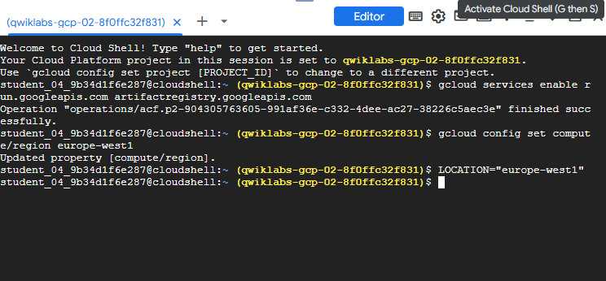
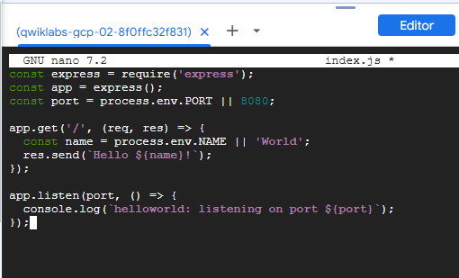
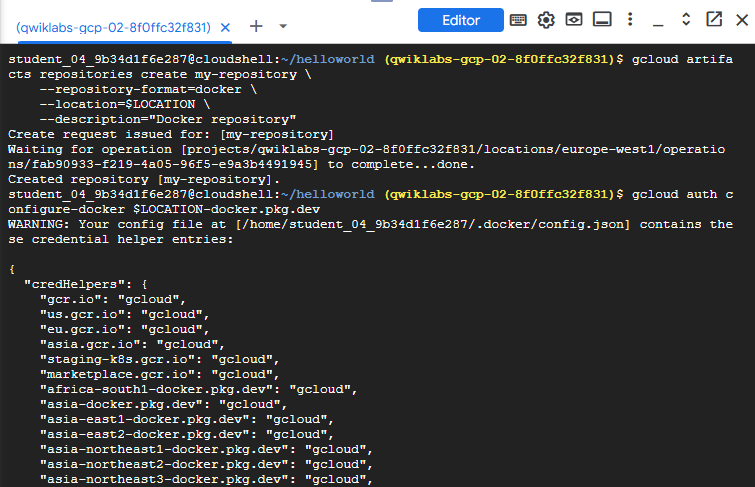
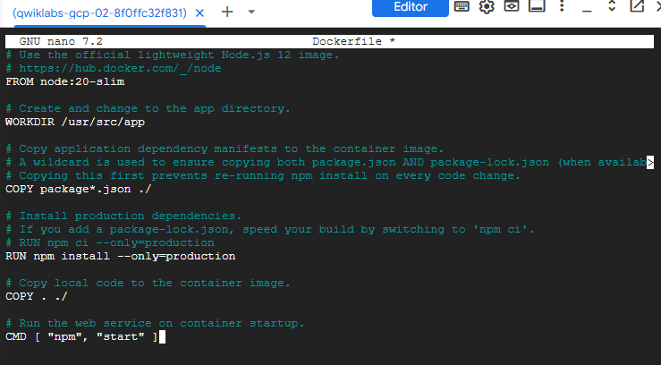
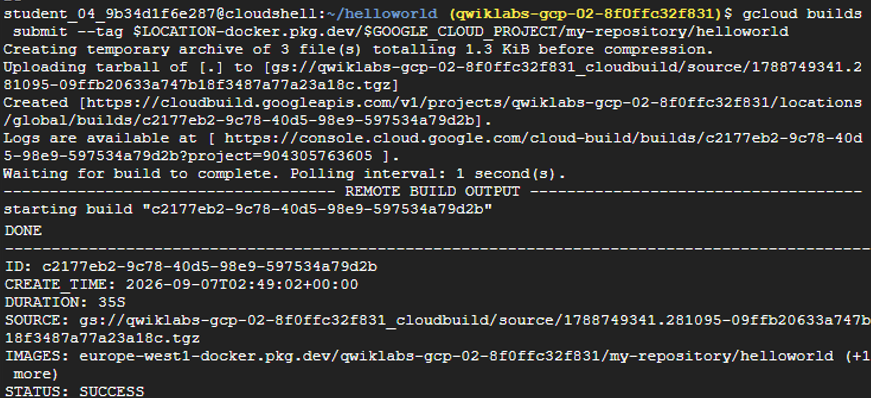
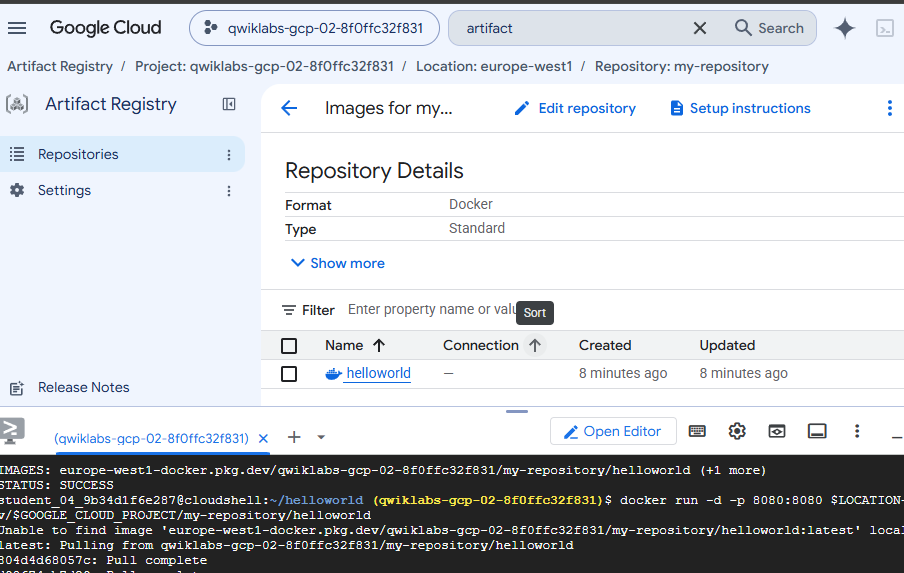
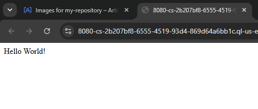
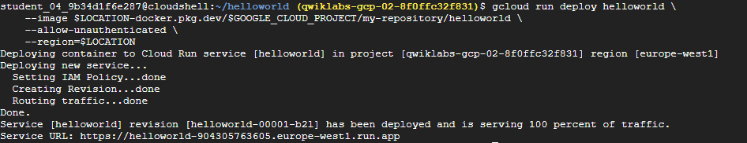
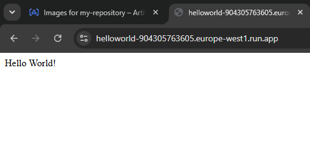
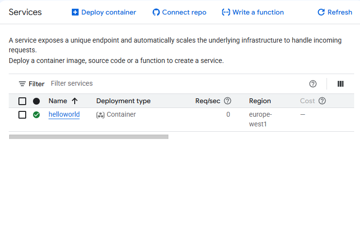

# Hello Cloud Run

## Overview

This lab demonstrates how to build and deploy a containerized Node.js application to **Cloud Run** using **Artifact Registry** and **Cloud Build**.

The implementation uses:

- **Cloud Shell** to develop and manage the application.
- **Node.js** and **Express** to build the web application.
- **Docker** and a **Dockerfile** to containerize the application.
- **Artifact Registry** to store the container image.
- **Cloud Build** to build the container image in the cloud.
- **Cloud Run** to deploy and serve the containerized application.

## Objectives

- Enable the required Google Cloud APIs.
- Create a Node.js application with Express.
- Create an Artifact Registry repository for Docker images.
- Write a Dockerfile to containerize the application.
- Build the container image using Cloud Build.
- Test the container image locally.
- Deploy the container to Cloud Run.
- Verify the running application through the Cloud Run service URL.

---

## Architecture

```text
                Developer
                    |
                    | Code
                    v
              Cloud Shell
                    |
                    | gcloud builds submit
                    v
             Cloud Build
                    |
                    | Container Image
                    v
          Artifact Registry
          my-repository
                    |
                    | gcloud run deploy
                    v
             Cloud Run
             helloworld
                    |
                    | HTTPS
                    v
                 User
```

---

# 1. Enable APIs and Configure Environment

The required APIs were enabled from Cloud Shell:

```bash
gcloud services enable run.googleapis.com artifactregistry.googleapis.com
```

The default compute region and a location variable were configured:

```bash
gcloud config set compute/region europe-west1
LOCATION="europe-west1"
```



---

# 2. Node.js Application

A directory for the application was created and initialized:

```bash
mkdir helloworld
cd helloworld
npm init -y
npm install express
```

The application file `index.js` was created with a simple Express web server:

```js
const express = require('express');
const app = express();
const port = process.env.PORT || 8080;

app.get('/', (req, res) => {
  const name = process.env.NAME || 'World';
  res.send(`Hello ${name}!`);
});

app.listen(port, () => {
  console.log(`helloworld: listening on port ${port}`);
});
```

The application listens on the port defined by the `PORT` environment variable, which Cloud Run sets automatically at runtime.



---

# 3. Artifact Registry Repository

A Docker repository named `my-repository` was created in Artifact Registry:

```bash
gcloud artifacts repositories create my-repository \
  --repository-format=docker \
  --location=$LOCATION \
  --description="Docker repository"
```

Docker was then configured to authenticate with Artifact Registry:

```bash
gcloud auth configure-docker $LOCATION-docker.pkg.dev
```

### Repository Configuration

```text
Name:     my-repository
Format:   Docker
Location: europe-west1
```



---

# 4. Dockerfile

A `Dockerfile` was created in the application directory to define how the container image is built:

```dockerfile
# Use the official lightweight Node.js 20 image.
FROM node:20-slim

# Create and change to the app directory.
WORKDIR /usr/src/app

# Copy application dependency manifests to the container image.
COPY package*.json ./

# Install production dependencies.
RUN npm install --only=production

# Copy local code to the container image.
COPY . ./

# Run the web service on container startup.
CMD [ "npm", "start" ]
```

The Dockerfile:

1. Uses the official `node:20-slim` base image to keep the image lightweight.
2. Sets `/usr/src/app` as the working directory.
3. Copies `package.json` and installs only production dependencies.
4. Copies the application source code.
5. Starts the application with `npm start`.



---

# 5. Container Image Build

The container image was built using **Cloud Build** and pushed directly to Artifact Registry:

```bash
gcloud builds submit \
  --tag $LOCATION-docker.pkg.dev/$GOOGLE_CLOUD_PROJECT/my-repository/helloworld
```

Cloud Build:

- Uploaded the application source code to Cloud Storage.
- Built the container image remotely using the Dockerfile.
- Pushed the resulting image to Artifact Registry.

### Build Result

```text
ID:       c2177eb2-9c78-40d5-98e9-597534a79d2b
DURATION: 35s
STATUS:   SUCCESS
IMAGES:   europe-west1-docker.pkg.dev/qwiklabs-gcp-02-8f0ffc32f831/my-repository/helloworld
```



---

# 6. Container Image in Artifact Registry

After a successful build, the `helloworld` container image appeared in Artifact Registry under the `my-repository` repository.



---

# 7. Local Container Test

The container image was tested locally in Cloud Shell before deploying to Cloud Run:

```bash
docker run -d -p 8080:8080 \
  $LOCATION-docker.pkg.dev/$GOOGLE_CLOUD_PROJECT/my-repository/helloworld
```

The application was then tested using Cloud Shell's web preview on port `8080`, which returned:

```text
Hello World!
```



---

# 8. Cloud Run Deployment

The container image was deployed to Cloud Run:

```bash
gcloud run deploy helloworld \
  --image $LOCATION-docker.pkg.dev/$GOOGLE_CLOUD_PROJECT/my-repository/helloworld \
  --allow-unauthenticated \
  --region=$LOCATION
```

Cloud Run:

- Created the `helloworld` service.
- Set the IAM policy to allow unauthenticated access.
- Created the first revision.
- Routed 100% of traffic to the new revision.

### Deployment Result

```text
Service:  helloworld
Revision: helloworld-00001-b2l
Region:   europe-west1
URL:      https://helloworld-904305763605.europe-west1.run.app
```



---

# 9. Application Running on Cloud Run

The deployed application was verified by accessing the Cloud Run service URL in the browser:

```text
https://helloworld-904305763605.europe-west1.run.app
```

The application responded with:

```text
Hello World!
```



---

# 10. Cloud Run Service

The `helloworld` service is visible in the Cloud Run console with its deployment type and region.

```text
Service:         helloworld
Deployment type: Container
Region:          europe-west1
```



---

# 11. Complete Commands Used

```bash
# Enable APIs
gcloud services enable run.googleapis.com artifactregistry.googleapis.com

# Configure region and location
gcloud config set compute/region europe-west1
LOCATION="europe-west1"

# Create and initialize the application
mkdir helloworld && cd helloworld
npm init -y
npm install express

# Create the Artifact Registry repository
gcloud artifacts repositories create my-repository \
  --repository-format=docker \
  --location=$LOCATION \
  --description="Docker repository"

# Configure Docker authentication
gcloud auth configure-docker $LOCATION-docker.pkg.dev

# Build and push the container image
gcloud builds submit \
  --tag $LOCATION-docker.pkg.dev/$GOOGLE_CLOUD_PROJECT/my-repository/helloworld

# Test locally
docker run -d -p 8080:8080 \
  $LOCATION-docker.pkg.dev/$GOOGLE_CLOUD_PROJECT/my-repository/helloworld

# Deploy to Cloud Run
gcloud run deploy helloworld \
  --image $LOCATION-docker.pkg.dev/$GOOGLE_CLOUD_PROJECT/my-repository/helloworld \
  --allow-unauthenticated \
  --region=$LOCATION
```

---

# 12. Technologies and Services

| Service / Technology | Purpose                                            |
| -------------------- | -------------------------------------------------- |
| Cloud Shell          | Development and command-line environment           |
| Node.js              | JavaScript runtime for the web application         |
| Express              | Web framework for Node.js                          |
| Docker               | Containerization platform                          |
| Dockerfile           | Instructions to build the container image          |
| Cloud Build          | Builds and pushes the container image remotely     |
| Artifact Registry    | Stores the Docker container image                  |
| Cloud Run            | Deploys and serves the containerized application   |

---

# 13. Key Concepts

### Cloud Run

Cloud Run is a fully managed serverless platform that automatically scales containerized applications. It handles infrastructure provisioning, scaling, and routing, so only the container image needs to be provided.

### Artifact Registry

Artifact Registry is a managed service for storing and managing container images and other build artifacts. It integrates directly with Cloud Build and Cloud Run.

### Cloud Build

Cloud Build is a serverless build platform that executes builds in the cloud. It can build Docker images from a Dockerfile and push them to Artifact Registry without requiring a local Docker environment.

### Dockerfile

A Dockerfile defines the instructions to build a container image. It specifies the base image, working directory, dependencies, and startup command.

### `--allow-unauthenticated`

This flag makes the Cloud Run service publicly accessible without requiring authentication. In a production environment, access control should be configured using IAM.

### `PORT` Environment Variable

Cloud Run automatically injects the `PORT` environment variable into the container. Applications must listen on this port to receive traffic.

---

# 14. Security Considerations

The configuration used in this laboratory was intended for a controlled learning environment.

For a production deployment, the following improvements should be considered:

- Remove `--allow-unauthenticated` and configure IAM-based access control.
- Use **Secret Manager** for any sensitive configuration values.
- Apply the **principle of least privilege** to service accounts.
- Enable **VPC connectors** for private network access if needed.
- Configure **minimum and maximum instance limits** to control scaling behavior.
- Use a custom domain with **Cloud Run domain mappings**.

---

# 15. End-to-End Application Flow

```text
Developer
    |
    | writes index.js + Dockerfile
    v
Cloud Shell
    |
    | gcloud builds submit
    v
Cloud Build
    |
    | builds container image
    v
Artifact Registry
my-repository/helloworld
    |
    | gcloud run deploy
    v
Cloud Run
helloworld service
    |
    | HTTPS request
    v
User → Hello World!
```

---

# Conclusion

This laboratory provided practical experience building and deploying a containerized application on Google Cloud using a modern serverless workflow.

The main steps were creating a Node.js application, containerizing it with Docker, building the image with Cloud Build, storing it in Artifact Registry, and deploying it to Cloud Run.

The final result was a fully managed, publicly accessible web application running at a Cloud Run URL, with automatic scaling and no server infrastructure to manage.